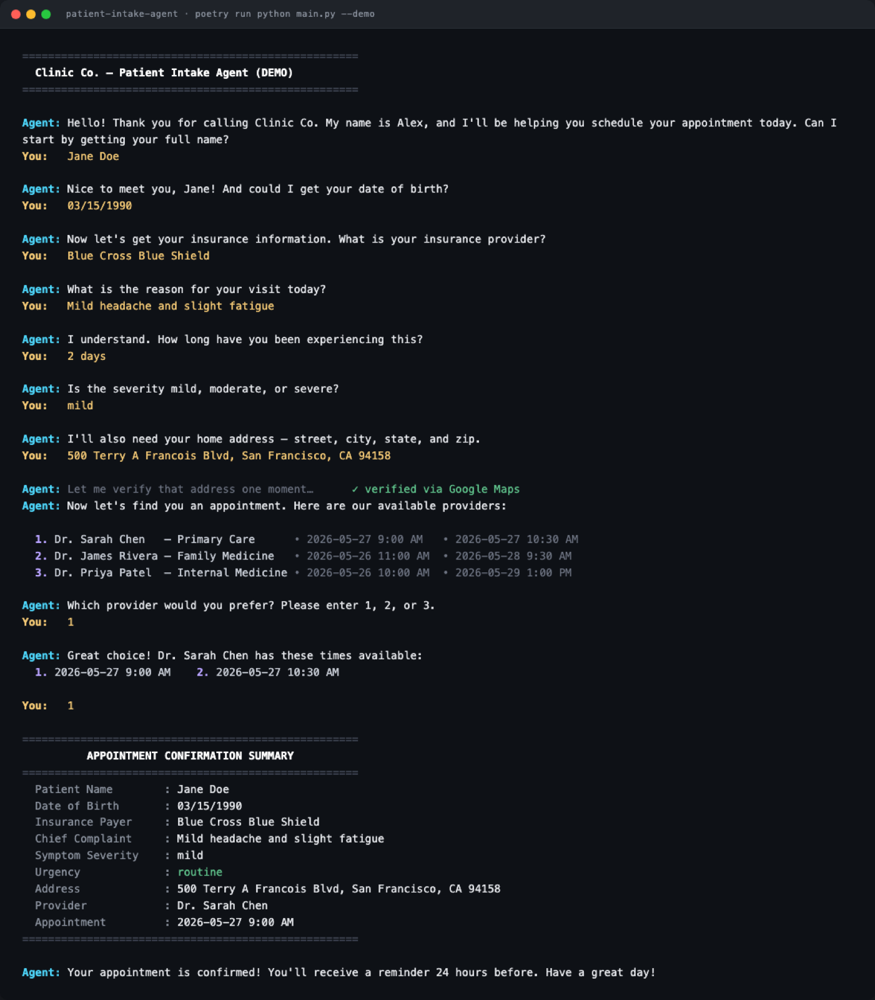

# Patient Intake Agent

> A terminal-based patient intake and scheduling agent. GPT-4o drives a conversational triage flow, makes tool calls to validate addresses (Google Maps Geocoding) and rank providers by urgency, and books slots. Emergency symptoms short-circuit to a 911 redirect. Ships with a deterministic `--demo` mode that needs no API keys.

[](https://github.com/Kaustubha-09/patient-intake-agent/actions)
[](https://www.python.org)
[](https://python-poetry.org)
[](https://openai.com)
[](https://developers.google.com/maps/documentation/geocoding)
[](LICENSE)

A working intake agent that demonstrates a specific architectural pattern: **the LLM drives the conversation, but deterministic Python tools own every data-bearing operation**. Address validation hits Google Maps; provider ranking is rule-based; emergency escalation is a hard two-layer gate (system-prompt instruction + tool-layer refusal). Every session is appended to `intake.log` for audit. Demo mode reproduces the same flow with hand-rolled responses, so the UX is reviewable without spending API credits.

---

## Screenshots

<p align="center">
  
</p>

A full `poetry run python main.py --demo` session: name → DOB → insurance → symptoms → address (Google-Maps-verified) → provider selection from the mock registry → slot pick → confirmation summary → audit-log close-out. The same flow runs against the real GPT-4o agent in non-demo mode; only the conversational text generation is mocked.

---

## Features

### Conversation
- **Two run modes** — `poetry run python main.py` (real GPT-4o + Google Maps, requires keys) and `poetry run python main.py --demo` (scripted, no keys).
- **Natural-language intake** — name, address, symptoms, urgency, preferred slot — all collected via dialogue.
- **ANSI-styled terminal** — color-coded agent / user / tool messages, bold headers, end-of-session summary.

### Tool layer
- **`validate_address`** — Google Maps Geocoding API; returns `{valid, formatted_address}`. Catches typos, normalizes formatting.
- **`rank_providers`** — orders the three mock providers by urgency policy. Urgent → Internal Medicine first; routine → Primary Care / Family Medicine first. **Emergency → returns empty.**

### Triage
- **Routine** → Primary Care / Family Medicine first; patient picks the slot.
- **Urgent** → Internal Medicine first; earliest slot auto-selected.
- **Emergency** → 911 directive, session ends with `ended (emergency)` status, no scheduling.

### Safety
- **Two-layer emergency gate** — system prompt instructs the LLM to escalate; tool layer refuses to rank for emergency urgencies.
- **Audit log** — every agent message, user input, tool call, and tool result appended to `intake.log` with timestamps.
- **`intake.log` is gitignored** — per-session contents may include patient input.

---

## Architecture

```
       ┌───────────────────────────────────────────┐
       │           main.py (CLI loop)              │
       │  argparse · ANSI styling · _setup_logger  │
       └─────────────────┬─────────────────────────┘
                         │
            ┌────────────┴────────────┐
            ▼                         ▼
  ┌───────────────────┐      ┌──────────────────┐
  │   run_agent()     │      │   run_demo()     │
  │   GPT-4o + tools  │      │   scripted flow  │
  └────────┬──────────┘      └──────────────────┘
           │
           │ tool_calls (OpenAI function calling)
           ▼
  ┌───────────────────────────────────────────┐
  │  _resolve_tool_calls / _dispatch_tool     │
  │   ├─ validate_address  → Google Maps      │
  │   └─ rank_providers    → urgency policy   │
  └───────────────────────────────────────────┘
                         │
                         ▼
              ┌──────────────────────┐
              │     intake.log       │
              │  per-session audit   │
              │  trail (gitignored)  │
              └──────────────────────┘
```

Full architectural walkthrough in [docs/architecture.md](docs/architecture.md). Dated ADRs in [docs/decisions.md](docs/decisions.md).

### Project structure

```
patient-intake-agent/
├── main.py                    # Single-file agent (~24 KB, ~12 top-level functions)
├── pyproject.toml             # Poetry config
├── poetry.lock
├── instructions.md            # Running instructions
├── .env.example               # Template for OPENAI_API_KEY + GOOGLE_MAPS_API_KEY
├── .github/workflows/ci.yml   # py_compile + demo-mode smoke test
├── docs/                      # Architecture, ADRs, limitations, roadmap, case study
├── Screenshots/               # Terminal captures
└── LICENSE                    # MIT
```

### Key functions in `main.py`

| Function | Purpose |
|---|---|
| `_agent_turn` | Send messages to GPT-4o; resolve any tool calls; append assistant reply |
| `_resolve_tool_calls` | Dispatch each `tool_calls[]` entry; append result to message list |
| `_validate_address` | Tool — Google Maps Geocoding; returns `{valid, formatted_address}` |
| `_rank_providers` | Tool — orders mock providers by urgency; empty list on emergency |
| `_chat` | Single OpenAI chat-completions call with tool schema attached |
| `_print_summary` | End-of-session summary printed to stdout |
| `_setup_logger` | File logger writing to `intake.log` |

### Providers + slots (mock)

| Provider | Specialty | Location |
|---|---|---|
| Dr. Sarah Chen | Primary Care | Downtown Clinic |
| Dr. James Rivera | Family Medicine | Westside Medical Center |
| Dr. Priya Patel | Internal Medicine | Eastpark Health |

3 slots per provider, spanning the next 5 days. Real-deployment swap replaces `MOCK_PROVIDERS` / `MOCK_SLOTS` with calls into a clinic scheduling API — tool schemas don't change.

---

## Tech Stack

| Layer | Choice | Why |
|---|---|---|
| Language | Python ≥ 3.12, < 4.0 | Modern type hints, structural pattern matching |
| Package manager | Poetry | Lockfile, virtualenv, dev-deps |
| LLM | OpenAI GPT-4o via `openai>=2.3.0` | Tool/function calling is first-class |
| Geocoding | Google Maps Geocoding API via `requests` | Broadest address coverage, generous free tier |
| Env | `python-dotenv` | Local `.env` for keys |
| HTTP | `requests` | Single tool call; no async pool needed |
| Logging | Python `logging` to `intake.log` | Stdlib, gitignored |
| UI | ANSI escape codes in stdout | No `rich`/`colorama` overhead at this scope |

**Zero external dependencies beyond the four pinned in `pyproject.toml`.**

---

## Getting Started

### Prerequisites
- Python 3.12+
- Poetry — see [installation guide](https://python-poetry.org/docs/#installation)
- **Agent mode:** OpenAI API key (GPT-4o), Google Maps API key with [Geocoding API enabled](https://console.cloud.google.com/apis/library/geocoding-backend.googleapis.com)
- **Demo mode:** no API keys required

### Install

```bash
poetry install
```

### Run — full LLM agent

```bash
cp .env.example .env       # then fill in your keys
poetry run python main.py
```

### Run — demo mode

```bash
poetry run python main.py --demo
```

### Environment

```env
OPENAI_API_KEY=sk-...
GOOGLE_MAPS_API_KEY=AIza...
```

The Google Maps Geocoding API must be **explicitly enabled** in Google Cloud Console (not just provisioned with a key).

---

## Emergency Escalation

If symptoms are classified as **emergency** — chest pain, difficulty breathing, stroke signs, loss of consciousness, severe bleeding — the agent immediately:

1. Tells the patient to call 911.
2. Does **not** attempt to schedule.
3. Logs the session as `ended (emergency)`.

This branch is gated by the system prompt **and** reinforced by the tool layer — `_rank_providers` returns an empty list for emergency urgencies. Two-layer defense because one layer alone could fail.

---

## Logs

Agent mode appends every session to `intake.log` (gitignored):

```
2026-04-19 10:30:00  ─── SESSION START ───────────────────────────────────
2026-04-19 10:30:01  [AGENT]  Could you please provide your full name?
2026-04-19 10:30:05  [USER]   Jane Doe
2026-04-19 10:30:06  [TOOL CALL]   validate_address | {"address": "..."}
2026-04-19 10:30:06  [TOOL RESULT] validate_address | {"valid": true, ...}
2026-04-19 10:30:10  ─── SESSION END (completed) ──────────────────────────
```

The same log format captures emergency escalations, abandoned sessions, and tool failures with the corresponding terminal status.

---

## Tradeoffs

- **LLM drives, tools own the data.** Address validation, provider ranking — every data-bearing operation goes through a deterministic Python function exposed as an OpenAI tool. The LLM cannot invent an address or hallucinate a provider. See [decisions.md, ADR-001](docs/decisions.md#adr-001--llm-drives-the-conversation-tools-own-the-data).
- **Two-layer emergency gate.** System prompt + tool refusal. Even if one layer fails, the other holds. See [ADR-002](docs/decisions.md#adr-002--emergency-is-a-hard-gate-not-a-recommendation).
- **Demo mode shares the tool layer.** `--demo` calls the *same* `_validate_address` and `_rank_providers` functions as the agent. They cannot diverge. See [ADR-009](docs/decisions.md#adr-009----demo-and-agent-share-the-same-tool-layer).
- **Single-file `main.py`.** ~24 KB. No submodule sprawl at this scope. See [ADR-004](docs/decisions.md#adr-004--single-file-mainpy-instead-of-a-package).
- **`intake.log` is gitignored.** Per-session contents may include patient input. Don't commit. See [ADR-005](docs/decisions.md#adr-005--intakelog-is-gitignored-not-committed).
- **Raw ANSI codes, not `rich`.** Five colors fit in 10 lines of constants — no 400 KB dep. See [ADR-008](docs/decisions.md#adr-008--ansi-styled-cli).

Full ADRs in [docs/decisions.md](docs/decisions.md).

---

## Limitations

See [docs/limitations.md](docs/limitations.md). Top items:

- **Not a clinical triage tool.** Demo of the workflow shape; not certified medical decision support.
- **Not HIPAA-compliant.** Audit log is plaintext on local disk.
- **Mock providers + slots.** Real EHR integration is a roadmap item.
- **No retries on transient OpenAI errors.** Production hardening is a follow-up.
- **English-only, terminal-only.** Web / SMS / voice surfaces are roadmap.

---

## Roadmap

See [docs/roadmap.md](docs/roadmap.md). The shape:

1. **Robustness** — retry/backoff, max-turn cap, schema validation, structured logging.
2. **Surfaces** — web (FastAPI), SMS (Twilio), voice (Twilio + Whisper + Eleven Labs) — same tool layer.
3. **Real EHR integration** — swap `MOCK_PROVIDERS` for live scheduling API.
4. **Multilingual** — Spanish, Mandarin, Hindi.
5. **Confidence + escalation** — LOW-confidence cases route to human review.
6. **Compliance harness** — HIPAA-aligned audit, PII redaction, BAA-ready cloud.

---

## Quality Gates

- `poetry run python -m py_compile main.py` clean.
- `poetry run python main.py --demo` runs end-to-end without keys.
- Tool schemas validated against OpenAI function-calling spec (`type=function`, `parameters` JSON Schema).
- `intake.log` in `.gitignore` (verified in CI).
- Emergency gate verified by tool refusal: `_rank_providers(urgency="emergency")` returns empty list.
- `.env` in `.gitignore`; secrets never committed.

---

## Project Stats

- **1** source file (`main.py`), ~24 KB, ~12 top-level functions
- **2** run modes (agent, demo)
- **2** tools (`validate_address`, `rank_providers`)
- **3** mock providers × **3** slots each
- **3** urgency classes (routine, urgent, emergency)
- **4** pinned dependencies (`openai`, `python-dotenv`, `requests`, plus Python stdlib `logging`)

---

## Resume Bullets

- Built a **GPT-4o-driven patient intake & scheduling agent** in Python with deterministic tool calls — address validation via Google Maps Geocoding, provider ranking via in-memory urgency policy — so the LLM owns the conversation but never owns the data.
- Implemented a **two-layer emergency-escalation gate** (system prompt directive + tool-layer refusal to rank providers for emergency urgencies) — single-layer defense in safety-critical branches is insufficient.
- Designed a **demo mode that shares the production tool layer** — `--demo` hand-rolls the conversational text but calls the same `_validate_address` and `_rank_providers` functions, so demo behavior cannot diverge from real behavior.
- Wrote an **append-only audit log** per session (`intake.log`) capturing every agent message, user input, tool call, and tool result with timestamps and terminal status (`completed` / `emergency` / `abandoned`).
- Kept the agent surface to a **single `main.py` (~24 KB)** while documenting the architectural seams (LLM ↔ tool boundary, demo ↔ agent shared dispatch) as ADRs so the next refactor is mechanical.

---

## Interview Talking Points

**LLM drives, tools own the data.** This is the most important architectural decision. The LLM's job is conversation: warmth, clarification, intent. The tools' job is facts: this address is real, this provider exists, this slot is available. If you let the LLM "validate" an address by reasoning about it, it will confidently produce wrong outputs. By exposing `validate_address` as a tool that hits Google Maps, the validation is auditable and the LLM is forced to call it. Same logic for provider ranking — the LLM doesn't *decide* which provider to recommend; it *requests* a ranking and presents the result.

**Two-layer emergency gate.** The system prompt tells the LLM: classify chest pain / breathing difficulty / stroke / consciousness loss as emergency and short-circuit to 911. The tool layer reinforces this: `_rank_providers(urgency="emergency")` returns an empty list. Even if the LLM somehow continues past the 911 prompt (jailbreak, confusion, edge phrasing), the tool layer refuses to schedule. **Safety-critical decisions need two layers minimum.**

**Demo mode that exercises the same code.** `--demo` hand-rolls the conversational text — *but it calls the same `_validate_address` and `_rank_providers` functions as the real agent.* This is the difference between a "demo" that lies about what the system does and a demo that actually reproduces the production code path. Reviewers see real behavior; bugs in tools show up in both modes.

**Single-file `main.py`.** ~24 KB. ~12 functions. The project is one terminal flow with one set of tools. Splitting into a `package/__init__.py` + `agent.py` + `tools.py` + `cli.py` would be ceremony, not clarity, at this scope. When the project grows past ~500 lines or gets a second surface (web, voice), the function boundaries are already clean enough to refactor in a day.

**The honest scope.** This is a workflow demo, not a clinical triage tool. The triage rules aren't clinically validated. The audit log is plaintext on local disk, not HIPAA-grade. The providers are mocks, not a real EHR integration. I documented all of this in [limitations.md](docs/limitations.md). The point of a portfolio project is to demonstrate engineering judgment, not to overclaim a regulatory pathway.

---

## License

[MIT](LICENSE)

---

*Built by [Kaustubha Eluri](https://github.com/Kaustubha-09).*
